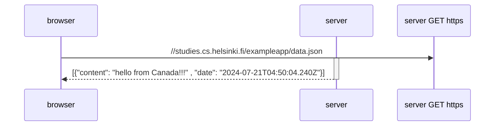

```mermaid
sequenceDiagram
  participant browser
  participant server

  browser->>server  GET https://studies.cs.helsinki.fi/exampleapp/data.json
  activate server
  server-->>browser: [{"content": "hello from Canada!!!" , "date": "2024-07-21T04:50:04.240Z"}]
  deactivate server
```
