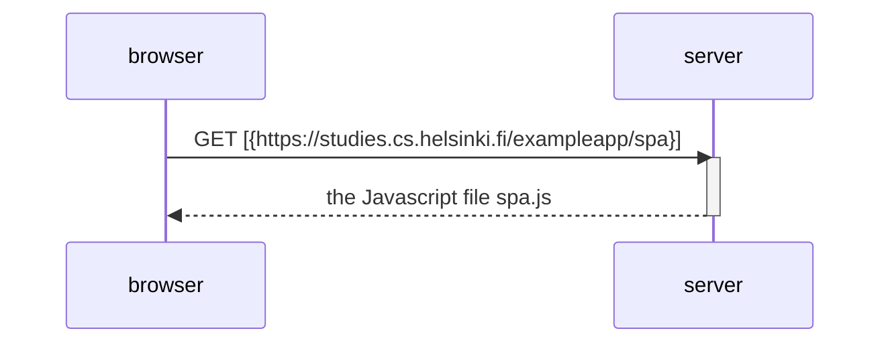

```mermaid
sequenceDiagram
  participant browser
  participant server

browser ->>server: GET [{https://studies.cs.helsinki.fi/exampleapp/spa}]
activate server
server -->> browser : the Javascript file spa.js
deactivate server
```
